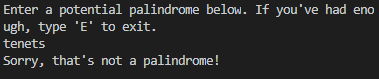

# Overview
I originally made a palindrome checker in Java, and I decided to port it over to C++ to help me learn the syntax of the language. The user enters a string, and it is run through a very fast algorithm to determine whether it is a palindrome. If it is a palindrome, then the user can print it in box form on the screen.
# Environment
* VSCode
* MinGW C++ compiler (see link below)
# Execution

# Useful Websites
* [The original Java project](https://github.com/opera22/Palindromes)
* [MinGW C++ compiler](http://www.mingw.org/wiki/Install_MinGW)
* [C++ documentation](http://www.cplusplus.com/)